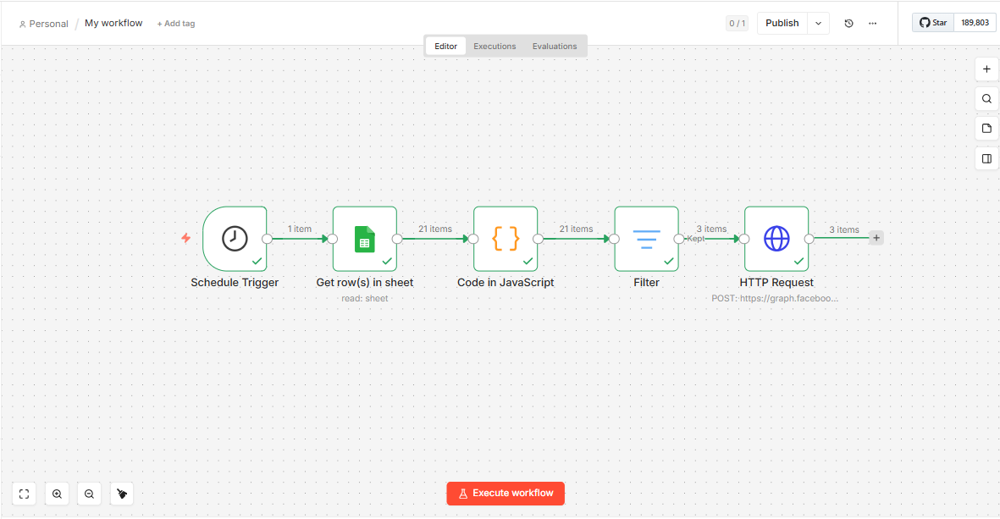

# 🍰 Confeitaria Full Stack & Automação

Sistema que automatiza os pedidos da minha confeitaria: quando o pagamento é aprovado, o pedido é registrado sozinho na planilha de produção e na agenda, e a confirmação é enviada por WhatsApp, sem digitação manual.

**Site em produção:** [confeitariadayaneteodoro.com.br](https://www.confeitariadayaneteodoro.com.br)
**Período de desenvolvimento:** jan. a abr. de 2026
**Resultado:** 90% dos pedidos processados sem digitação manual desde o lançamento.

**Stack:** Python · Flask · PostgreSQL (JSONB) · Mercado Pago SDK v2 · WhatsApp Cloud API · n8n · Docker · Gemini API · Google Apps Script · Render

---

## Demonstração

* 🎥 [Checkout e fluxo do pedido](https://github.com/Dayanebiaerafa/confeitaria-ecommerce-mercadopago/raw/main/static/assets/Checkout-e-fluxo-do-pedido.gif)
* 🎥 [Assistente com Gemini em ação](https://github.com/Dayanebiaerafa/confeitaria-ecommerce-mercadopago/raw/main/static/assets/assistente/assistente.mp4)

Fluxo no n8n que verifica pedidos duplicados:



---

## O problema

Os pedidos de bolos personalizados chegavam por canais diferentes e exigiam digitação manual em planilha, agenda e mensagens ao cliente. O sistema automatiza esse caminho depois que o pagamento é aprovado.

---

## Como funciona

1. O cliente monta o pedido no site (regras de peso mínimo, prazo e recheios validadas em JavaScript).
2. O pagamento é feito pelo Checkout Transparente do Mercado Pago (Pix ou cartão), com `device_id` para prevenção de fraude.
3. O Mercado Pago avisa o endpoint `/webhook`; quando o status muda para `approved`, o back-end inicia o pós-venda.
4. O pedido é gravado no PostgreSQL (campos principais em colunas; o conteúdo completo em JSONB), registrado na planilha de produção e agendado no Google Calendar.
5. O cliente recebe a confirmação por WhatsApp (templates oficiais da Meta).

---

## Decisões de engenharia

* **JSONB para pedidos personalizados:** massas, recheios e toppings mudam com frequência; guardar o conteúdo completo evita alterar o banco a cada ajuste de cardápio.
* **Prevenção de pedidos duplicados (idempotência):** o back-end verifica duplicidade antes de registrar o pedido, e um fluxo no n8n (Docker) varre os registros e envia alerta quando encontra conflito.
* **Webhook:** o pós-venda parte do aviso de pagamento aprovado, então o sistema só trabalha com pedidos pagos.
* **Dados de clientes:** CPF mascarado nos logs, telefones padronizados no formato E.164 e chaves de API em variáveis de ambiente no Render.
* **Agente de atendimento:** assistente com Gemini API e RAG (via Google Apps Script) que responde com base nas políticas da loja (prazos, taxas de entrega, sabores e valores).
* **Deploy:** publicado no Render com domínio próprio e atualização automática a partir do GitHub.

---

## Como foi desenvolvido

Usei IA generativa (Claude e Gemini) para acelerar a escrita do código. Os testes dos endpoints (Postman) e a validação do fluxo de pagamento, webhooks e mensagens foram feitos por mim.

---

## Como rodar localmente

```bash
git clone https://github.com/Dayanebiaerafa/confeitaria-ecommerce-mercadopago.git
cd confeitaria-ecommerce-mercadopago
python -m venv .venv
# Ative o ambiente virtual:
# Windows: .venv\Scripts\Activate.ps1
# Linux/macOS: source .venv/bin/activate
pip install -r requirements.txt
python app.py
```

### Variáveis de ambiente

O projeto depende de contas e credenciais próprias (Mercado Pago, Meta/WhatsApp, Google Cloud e um banco PostgreSQL). Crie um arquivo `.env` na raiz do projeto com as variáveis abaixo e **não envie esse arquivo ao GitHub**.

| Variável | Para que serve |
|---|---|
| `DATABASE_URL` | URL de conexão com o PostgreSQL |
| `MP_ACCESS_TOKEN` | Access token do Mercado Pago |
| `ADMIN_PASSWORD` | Senha das rotas administrativas |
| `SHEET_ID` | ID da planilha do Google Sheets (precisa ter uma aba chamada `PEDIDOS`) |
| `GOOGLE_PROJECT_ID` | ID do projeto no Google Cloud |
| `GOOGLE_CLIENT_ID` | ID do cliente da conta de serviço do Google |
| `GOOGLE_SERVICE_ACCOUNT_EMAIL` | E-mail da conta de serviço do Google |
| `GOOGLE_PRIVATE_KEY` | Chave privada da conta de serviço, em uma única linha, com `\n` no lugar das quebras de linha |
| `GOOGLE_PRIVATE_KEY_ID` | ID da chave privada |
| `WA_PHONE_TOKEN` | Token de acesso da WhatsApp Cloud API (Meta) |
| `WA_PHONE_ID_FACE` | ID do número de telefone na WhatsApp Cloud API |
| `SEU_NUMERO` | Número de WhatsApp pessoal do responsável |
| `WEBHOOK_VERIFY_TOKEN` | Token de verificação do webhook do WhatsApp (você define e informa à Meta) |

---

## Aprendizados

Construí este projeto para resolver um problema real. Ele me ensinou a lidar com arquitetura orientada a eventos, tratar falhas de rede e webhooks repetidos, proteger dados sensíveis de clientes e integrar vários serviços externos de forma confiável.

---

## 👩‍💻 Sobre a Desenvolvedora
**Desenvolvido por Dayane Teodoro**  
Reside em Uberlândia - MG. 

Desenvolvedora de software em transição de carreira, vinda da gestão do próprio negócio, com foco em automação e IA. Graduada em Análise e Desenvolvimento de Sistemas.

---

## 📩 Contato
* **LinkedIn:** [Dayane Teodoro](https://www.linkedin.com/in/dayaneteodoro/)
* **Portfólio:** [confeitariadayaneteodoro.com.br](https://www.confeitariadayaneteodoro.com.br)
* **E-mail:** dayaneteodorob@outlook.com

> *"A tecnologia só faz sentido quando resolve um problema real."* 
> 
> Se este projeto agregou valor, deixe uma ⭐ no repositório!

